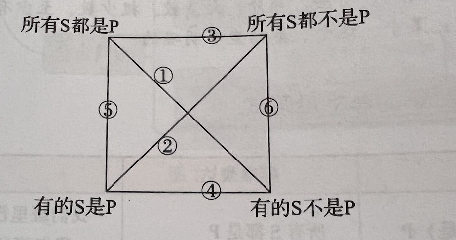
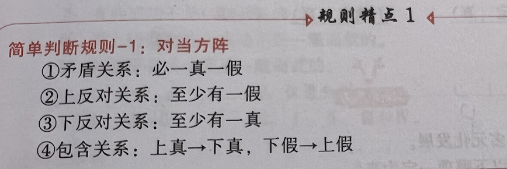
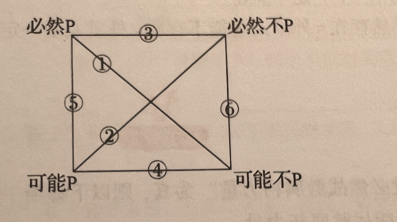

# 逻辑基础

## 形式逻辑基础

### 直言判断标准形式与非标准形式

| 标准式       | 简称         |
| :----------- | :----------- |
| 全称肯定判断 | 所有S都是P   |
| 全称否定判断 | 所有S都不是P |
| 特称肯定判断 | 有的S是P     |
| 特称否定判断 | 有的S不是P   |
| 单称肯定判断 | 这个S是P     |
| 单称否定判断 | 这个S不是P   |

| 非标准表达             | 标准表达     |
| :--------------------- | :----------- |
| 没有（一个）S不（是）P | 所有S都是P   |
| 没有S是P               | 所有S都不是P |
| S不都是P               | 有的S不是P   |
| S不都不是P             | 有的S是P     |

### 直言判断对当方阵

**推导时候需要注意其中的不确定性**

### 直言判断换位规则

+ 全称只可逆否，不可置换
+ 特称只可逆否，不可置换

$$
全称：\rightarrow ，特称：\Rightarrow \\[15pt]
\begin{matrix}
    所有S都是P: S \rightarrow P = \neg P  \rightarrow \neg S\\[10pt]
    所有S都不是P: S \rightarrow \neg P =  P \rightarrow \neg S \\[20pt]
    S \rightarrow P为真\begin{cases}
        有的 S \Rightarrow P 为真 \\
        有的 P \Rightarrow S 为真
    \end{cases} \\[20pt]

    有的S\Rightarrow P为真\begin{cases}
        只能判断 &有的P\Rightarrow S为真 \\
        不能判断 &有的\neg P\Rightarrow \neg S为真
    \end{cases}
\end{matrix}
$$

### 直言判断综合推理

**最后两个需要注意顺序**
$$
前提：A \rightarrow B,B \rightarrow C，则 A \rightarrow C \\[10pt]
前提：A \rightarrow B,C \Rightarrow A, 则 C \Rightarrow B \\[10pt]
前提：A \rightarrow B, C \Rightarrow \neg B,则 C \Rightarrow \neg A \\[10pt]
前提：A \rightarrow B,B \rightarrow C,D \Rightarrow A,则 D \Rightarrow A \Rightarrow B \Rightarrow C \\[10pt]
前提：A \rightarrow B,B \rightarrow C,D \Rightarrow \neg C,则 D \Rightarrow \neg C \Rightarrow \neg B \Rightarrow \neg A \\
$$

### 模态判断

四种模态：

+ 必然P
+ 必然不P
+ 可能P
+ 可能不P

### 模态方阵

模态对当方阵的关系与直言判断对当方阵近似

+ 12必然一真一假
+ 3知道真另一个肯定假，知道假另一个不确定
+ 4知道假另一个真，知道真另一个不确定
+ 56上真下真，下假上假，反过来不确定

### 关系判断

+ 对称关系（A对B有，B对A有）
+ 反对称关系（A对B有，B对A没有）
+ 半对称关系（A对B有，B对A不一定有）

### 传递性关系

+ 传递关系（A对B有，B对C有，A对C有）
+ 反传递关系（A对B有，B对C有，A对C没有）
+ 半传递关系（A对B有，B对C有，A对C不一定有）

### 复合判断

+ 联言判断（且）
+ 相容选言判断（或）
+ 不相容选言判断（异或）

**判断的时候依旧需要注意有三种情况：真、假、不确定**

### 矛盾关系与常考公式

考点：一定假，不可能为真，不赞同，不同意，没有兑现承诺，最能反驳，最能削弱
$$
\neg (P \land Q) = \neg P \vee \neg Q \\[5pt]
\neg (P \vee Q) = \neg P \land \neg Q \\[5pt]
\lnot (P \forall Q) = (P \land Q) \lor (\lnot P \land \lnot Q)
$$