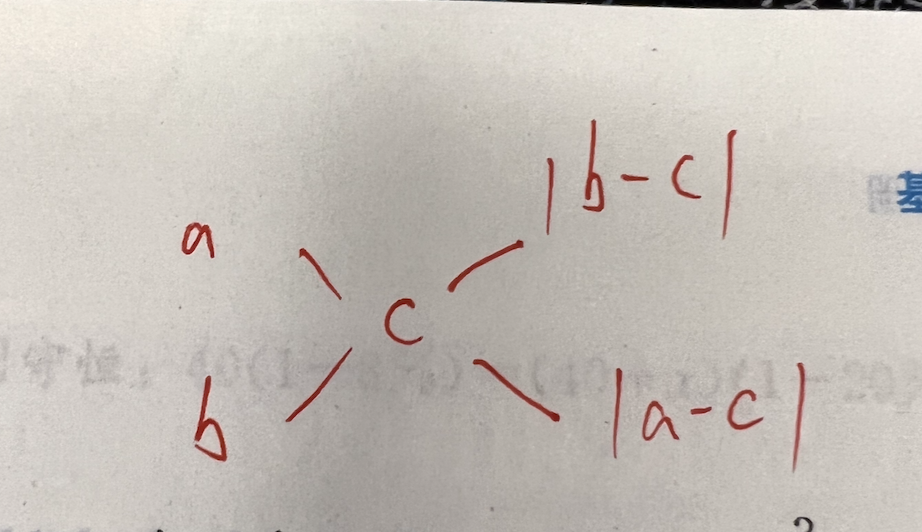
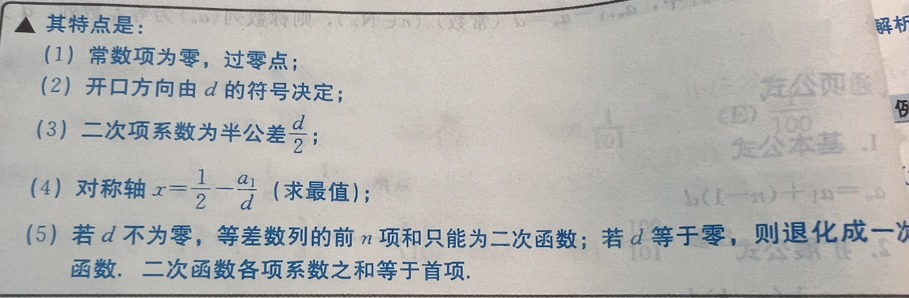

# 基础公式

## 1.算术

### 1.1实数的分类

$$
\text{实数}\begin{cases}
    \text{有理数} \begin{Bmatrix}
        \text{正有理数} \begin{cases}
            \text{正整数} \\
            \text{正分数}
        \end{cases}\\
        \text{0} \\
        \text{负有理数} \begin{cases}
            \text{负整数} \\
            \text{负分数}
        \end{cases}
    \end{Bmatrix} \text{有限循环、无限循环小数} \\
    \text{无理数} \begin{Bmatrix}
        正无理数 \\
        负无理数
    \end{Bmatrix} 无限不循环小数
\end{cases}
$$

### 1.2整数与自然数

整数Z: ...,-2,-1,0,1,2,...  
自然数N: 0,1,2,...

### 1.3质数与合数

### 1.4整除的特点

+ 2: 个位为0，2，4，6，8
+ 3: 各位数字之和能被3整除
+ 4: 末两位能被4整除
+ 5: 个位为0或者5
+ 6: 满足同时被2和3整除
+ 8: 末三位数字能被8整除  
+ 10： 个位必为0  

### 1.5倍数、约数

a能被b整除，a是b的倍数，b是a的约数  
最大公约数，最小公倍数  
``最大公约数可以用辗转相除法求``

``短除法``可以求最大公约数、最小公倍数, 短除法必须掌握

### 1.6质数、合数

质数：一个大于1的正整数，只能被1和本身整除，就是质数  
合数：除了能被1和它本身整除，还能被其他数整除  

#### 重要性质

+ 1既不是质数也不是合数
+ 2是质数、大于2的质数必为奇数

### 1.7互质

两个数公约数只有1，如4和9（求公倍数的时候游泳）

+ 几个两两互质的数，最大公约数是1 ，最小公倍数是他们的乘积
+ 两个数分别除以它们的最大公约数，所得的商一定互质
+ 两个数的最小公倍数分别除以这两个数，所得的商一定互质

常见互质数

+ 连续的两个自然数
+ 质数与质数
+ 中间是偶数的连续三个自然数

### 1.8奇数、偶数

``0是偶数``

组合性质

+ 奇 加减 奇 = 偶
+ 奇 加减 偶 = 奇
+ 偶 加减 偶 = 偶
+ 奇 乘 奇 = 奇
+ 奇 乘 偶 = 偶
+ 偶 乘 偶 = 偶

### 1.9比例

$$
a:b = c:d \Leftrightarrow ad = bc \\
a:b = c:d \Leftrightarrow b:a = d:c \Leftrightarrow b:d = a:c \Leftrightarrow d:b = a:c \\
a/b = c/d \\ \text{此时a,d称为外项，b,c称为内项}
$$

### 1.10正比、反比

$$
\begin{gather}
    y = kx \\
    y = k/x
\end{gather}
$$

### 1.11绝对值

$$
\vert a \vert = \begin{cases}
    a  &a\geq 0 \\
    -a &a\leq 0
\end{cases}
$$

#### 性质

1. 对称性
   1. 两个互为相反数的绝对值相等
2. 等价性
   1. $\sqrt{a^2} = \vert a \vert$
   2. $\vert a \vert ^2 = a^2$
3. 自比性
   1. $\frac{|x|}{x} = \frac{x}{|x|} = \begin{cases}
    1 &x>0 \\
    -1 &x<0
   \end{cases}$
4. 非负性
   1. 任何实数a的绝对值大于等于0
   2. 偶数次方，偶数次根式也是同理

### 1.12应用题（重点）

#### 比例问题

$$
变化率 = \frac{变化量}{变前量} * 100 \% = \frac{|现值 - 原值|}{原值} * 100 \% = |\frac{现值}{原值} - 1| * 100 \% \\
$$

$$
    \begin{cases}
        增长率p\% \underrightarrow{原值a} 现值a(1+p\%
        \\[4pt]
    下降率\% \underrightarrow{原值a} 现值a(1-p\%)
    \end{cases}
$$

**恢复原值问题**
$$
先降p\%,恢复原价需要增加\frac{p\%}{1 - p\%}\\[4pt]
增加p\%，恢复原价需要降低\frac{p\%}{1 + p\%}
$$

$$
等比定理：\frac{a}{b} = \frac{c}{d} = \frac{e}{f} = \frac{a+c+e}{b+d+f}(b+e+f \ne 0) \\[4pt]

总量 = \frac{部分量}{对应占的比例}

$$

#### 利润问题

$$
\begin{cases}
    利润 = 售价 - 进价 \\
    利润率 = \frac{利润}{进价} * 100\% = \frac{售价 - 进价}{进价} * 100\% = （\frac{售价}{进价} - 1）* 100\% \\
    售价 = 进价 *（1 + 利润率） = 进价 + 利润
\end{cases}
$$

#### 路程问题

**路程s，速度v，时间t 之间的关系**
$$
s = vt, v = \frac{s}{t},t = \frac{s}{v}
$$
**直线追及相遇问题**
$$
追及：S_\text{追及} = s_1 - s_2 = (v_1 - v_2)*t \\[10pt]
相遇：S_\text{相遇} = s_1 + s+2 = (v_1 + v_2)*t
$$
**圆圈形路程问题(第一次相遇时间为t)**
$$
同向运动：s= s_1 + s_2 = (v_1 + v_2)*t \\[10pt]
反向运动：s= s_1 - s_2 = (v_1 - v_2)*t
$$
需要掌握利用公式解决多次追及相遇问题

#### 工程问题

**工作量s，工作效率v，工作时间t之间的关系**
$$
工作量 = 工作效率 * 工作时间；工作时间 = \frac{工作量}{工作效率}\\[10pt]

工作效率 = \frac{工作量}{工作时间}
$$

**重要结论**
若甲单独完成需要m天，乙单独完成需要n天，则
$$
甲的效率为\frac{1}{m},乙的效率为\frac{1}{n} \\[10pt]

甲乙合作的效率为\frac{1}{m} + \frac{1}{n} \\[10pt]

甲乙合作完成需要的时间为\frac{1}{\frac{1}{m} + \frac{1}{n}} = \frac{mn}{m + n}
$$

#### 交叉法

交叉法用来算比例，如 a，b一高一低的两个值，知道中间值，可以算出一个比例，然后这个比例代入总数可以算得各自占的比例

#### 浓度问题

$$
溶液 = 溶质 + 溶剂 \\[10pt]

浓度 = \frac{溶质}{溶液} * 100\% = \frac{溶质}{溶液 + 溶剂} * 100\% \\[10pt]

溶质 = 溶液 * 浓度 \\[10pt]

溶剂 = 溶液 * （1 - 浓度）
$$

**命题思路**
题型重点是找准不变量套公式进行求解

1. 稀释问题，溶质不变
2. 加浓问题，溶剂不变
3. 浓缩问题，溶质不变
4. 混合问题，溶质或者溶剂质量守恒（杠杆原理求比例）

## 2.代数

### 常用公式

$$
a^2 - b^2 = (a+b)(a-b) \\[10pt]
（a \pm b）^2 = a^2 \pm 2ab + b^2 \\[10pt]
a^3 + b^3 = (a + b)(a^2 - ab + b^2) \\[10pt]
a^3 - b^3 = (a - b)(a^2 + ab + b^2) \\[10pt]
a^2 + b^2 + c^2 + 2ab + 2bc + 2ac = (a + b + c)^2 \\[10pt]
a^3 \pm b^3 = (a \pm b)(a \mp ab + b^2)
a^2 + b^2 + c^2 + ab + bc + ac = \frac{1}{2}[(a + b)^2 + (b + c)^2 + (a + c)^2]
$$

### 整式加减、乘除运算

加减运算：一般是求多项式系数
乘除运算：

+ 乘法运算一般是考察多项式两边系数相等
+ 除法运算的重点是因式定理

**因式定理**：
$$ 当f(x)含有（x-a) \Leftrightarrow f(x)能被(x - a)整除 \Leftrightarrow f(a) = 0$$

### 因式分解

+ 提公因式法
+ 运用公式法
+ 分组分解法（很恶心）
+ 十字相乘法
+ 拆项、补项法（很恶心）

### 一元二次函数（要素很多）

$$
y = ax^2 + bx + c = a(x + \frac{b}{2a}) + \frac{4ac - b^2}{4a} \\[5pt]
开口方向a决定，a>0向上，a<0向下\\[5pt]
对称轴：x = - \frac{b}{2a} \\[5pt]
最值点：（-\frac{b}{2a},\frac{4ac - b^2}{4a}）\\[5pt]
截距：y=c
$$

### 一元二次方程组

方程解的情况
$$
\Delta = b^2 - 4ac \begin{cases}
    >0 &有两个不等实根，x_1,x_2= \frac{-b \pm \sqrt{\Delta}}{2a} \\[5pt]
    =0 &两个相等实根，x_1=x_2=-\frac{b}{2a}\\[5pt]
    <0 &方程无实根
\end{cases}
$$

**韦达定理**
前提：x_1,x_2是方程的两个根
$$
x_1 + x_2 = - \frac{b}{a} \\[10pt]
x_1 * x_2 = \frac{c}{a}
$$

扩展定理
$$
\frac{1}{x_1} + \frac{1}{x_2} = \frac{x_1 + x_2}{x_1x_2} = - \frac{b}{c} \\[10pt]

\frac{1}{x_1^2} + \frac{1}{x_2^2} = \frac{(x_1 + x_2)^2 - 2x_1x_2}{(x_1x_2)^2}
$$

### 不等式
<!-- TODO 照下来，懒得敲了 -->
1. 传递性
2. 同向相加性
3. 同向皆正乘性
4. 皆正倒数性
5. 皆正乘（开）方性

解一元二次不等式组区间问题

+ 同大取大
+ 同小取小
+ 大大小小取中间
+ 大小小大没有解

### 数列裂项基本公式

$$
a_n = \frac{1}{n(n+1)} = \frac{1}{n} - \frac{1}{n + 1} \\[10pt]

a_n = \frac{1}{\sqrt{n} + \sqrt{n + 1}} = \sqrt{n + 1} - \sqrt{n} \\[10pt]

a_n = \frac{n}{n!} = \frac{1}{n!} - \frac{1}{(n + 1 )!} \\[10pt]

a_n = n * n! = (n + 1)! - n!
$$

### 等差数列

$$
a_n = a_1 + (n - 1)d\\[5pt]
a_k = a_k + (n - k)d\\[10pt]

S_n = \frac{(a_1 + a_n)d}{2} = na_1 + \frac{n(n - 1)d}{2} = \frac{d}{2}n^2 + (a_1 - \frac{d}{2})n \\[5pt]
$$

**等差数列前n项和图像性质**

**等差数列元素性质**  
元素性质
$$若m,n,l,k \isin Z_+, m+n = l+k, 则 a_m + a_n = a_l + a_k$$
求和性质
$$等差数列前n项和：S_n，S_2n - S_n，S_3n - S-2n， ... 也等差$$

### 等比数列

$$
a_n = a_1q^{n - 1} \\[5pt]
a_n = a_Kq^{n - k} \\[10pt]

S_n = \begin{cases}
    na_1 &q=1 \\[5pt]
    \frac{a_1(1- q^n)}{1 - q} = \frac{a_1 - a_nq}{1 - q} & q \ne 0 且 q \ne 1
\end{cases} \\[10pt]
推导：S_n * q - S_n = (q - 1) * S_n \\[10pt]
q \ne 1, \frac{S_n}{S_m} = \frac{1 - q^n}{1 - q^m}
$$

**数列求和三大件**：1倒序相加，2错位相减，3列项相消  
所有项目和S:
$$
只有无穷递缩等比数列（\vert q \vert < 1, q \ne 0 ）才有所有项和\\[10pt]
S = \frac{a_1}{1 - q}
$$

**等比数列元素性质**  
元素性质
$$若m,n,l,k \isin Z_+, m+n = l+k, 则 a_m * a_n = a_l * a_k$$
求和性质
$$等比数列前n项和：S_n，S_2n - S_n，S_3n - S-2n， ... 也等比$$

## 3.几何

### 角与线

角平分线性质：

+ 角平分线上的点到这个角的两边距离相等
+ 到一个角的两边距离相等的点在这个角的角平分线上

线与角的一些基础性质：

+ 邻角互补，对顶角相等
+ 平行线同位角相等，内错角互补，同旁内角相等

### 三角形

### 三角形面积公式

p:三角形半周长
$$S = \frac{1}{2}ah = \frac{1}{2}ab*\sin C = \sqrt{p(p - a)(p - b)(p - c)}$$

## 4.数据分析
